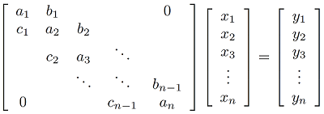

# C++ Tridiagonal Matrix

Yet another C++ implementation for [Tridiagonal Matrix](https://en.wikipedia.org/wiki/Tridiagonal_matrix) manipulation. This class provides simple and efficient methods for tridiagonal inversion and tridiagonal system of equations ([Thomas algorithm](https://en.wikipedia.org/wiki/Tridiagonal_matrix_algorithm)). 
 
## Usage

The tridiagonal matrix object can be instantiated with the following constructors:

```C++
TridiagonalMatrix(unsigned int n, float *lower, float *diagonal, float *upper);
TridiagonalMatrix(unsigned int n, float lower, float diagonal, float upper);
```

The matrix has size *n*&#215;*n*, with *n > 0*. The second constructor is used when all values along each of the diagonals are constant.

The inverse of the tridiagonal matrix is calculated with the following method:

```C++
float **inverse();
```

The returned value is a *n*&#215;*n* array.

A tridiagonal systems of equations can be solved with the following methods:



```C++
float *system(float *y);
static void inline system(float *y, float *x, unsigned int n, float lower, float diagonal, float upper);
```

The first method will use the matrix created by the constructor. The input values are given by the array *y*, while the calculated solutions are returned in the array *x*, allocated internally. The values of *y* and the original matrix are preserved.

The second (static) method solves the system with the values given by the parameters. The matrix values *a<sub>n<sub>*, *b<sub>n<sub>* and *c<sub>n<sub>* are given by *diagonal*, *upper* and *lower*, respectively. This method does not preserve the values of *y*.

The destructor method delete all allocated arrays, including the ones which pointers have been returned by the `inverse` and `system` methods.  

## Example

The `main.cpp` file contains a simple example of a 5x5 tridiagonal matrix:

```C++
#include "TridiagonalMatrix.h"

int main(void)
{
  //Tridiagonal inverse
  TridiagonalMatrix *TRI = new TridiagonalMatrix(5, 1, 4, 1);

  float **f = TRI->inverse();

  //Tridiagonal system (dynamic)
  float y[] ={ 1, 2, 3, 4, 5 };

  float *x = TRI->system(y);

  //Tridiagonal system (static)
  float *z = new float[5];

  TDM::system(y, z, 5, 1, 4, 1);

  delete TRI;

  return 0;
}
```

## Citing

```TeX
@MISC{Kugler2019,
  author = "Mauricio Kugler",
  title = "ANSI C++ Tridiagonal Matrix",
  year = "2019",
  url = "https://github.com/mauriciokugler/tridiagonal-matrix",
  note = "Version 1.0.0"
}
```

## License

This project is licensed under the [MIT License](LICENSE).
